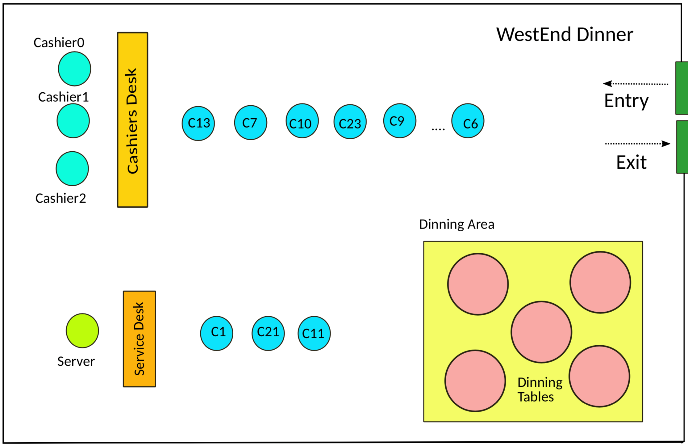

# A restaurant application with IPC, shared memory and semaphores

[](https://github.com/SamSamhuns/restaurant_app_sh_mem/actions/workflows/main.yaml)[](https://www.codacy.com/app/samhunsadamant/restaurant_app_sh_mem?utm_source=github.com&amp;utm_medium=referral&amp;utm_content=SamSamhuns/restaurant_app_sh_mem&amp;utm_campaign=Badge_Grade)

This application demonstrates the concept of IPC, POSIX shared memory and semaphores. The build is supported in both `linux` and `darwin/OSX` systems.



## Build

```shell
make all
```

## Run

Only one `coordinator` and `server` should be invoked. However, multiple number of `cashiers` (Which is under `MaxNumOfCashiers`) and `clients` can be invoked. Each command arguments are discussed in the implementation below.

Once the binaries are created, run the following scripts in **different terminal sessions**. Note: make sure `MaxTimeWait` is a large number when invoking the coordinator to have enough time to invoke the other participants.

```shell
# run in terminal 1
./coordinator -n MaxNumOfCashiers -p MaxPeople -t MaxTimeWait
# run in terminal 2
./server -m shmid
# run in terminal 3
./cashier -s serviceTime -b breakTime -m shmid
# run in terminal 4
./client -i itemId -e eatTime -m shmid
```

Data on individual clients and orders are saved in the `db` folder while the summary statistics such as `average waiting time for all customers`, `total visiting clients`, `total revenue` and `top five most popular dishes` are displayed when all clients have been served and the `coordinator` exits and saved in the `stats` folder as well.

### Clean build artifacts

```shell
make clean
```

### Notes on each program

#### 1)  Coordinator

When the `coordinator` is invoked with the command below. It creates a shared memory and named semaphores under the POSIX standards, finally printing out the `shmid`. The other participants/processes access this shared memory through the `shmid`.

Note: The `shmid` is defined as global constant `SHMID` in `common.h`

```shell
./coordinator -n MaxNumOfCashiers -p MaxPeople -t MaxTimeWait
```

- `MaxNumOfCashiers` is the maximum number of cashiers that can be operating and invoked after the coordinator begins operation for the restaurant app.
- `MaxPeople` is the maximum number of clients that can be present in the restaurant at any given time. If more clients attempt to join, they will simply exit.
- `MaxTimeWait` is the maximum time that the restaurant waits before closing the shop given that no new clients have entered and all current clients have left the restaurant.

#### 2)  Server

The `server` needs access to the menu data structure in the shared memory segment with id `shmid` initialized by the `coordinator`.

```shell
./server -m shmid
```

#### 3)   Cashier

A `cashier` checks the `MaxNumOfCashiers` value in the shared memory (**shm**) with id `shmid` initialized by the `coordinator`. The `cur_n_cashiers`in`shm`must be less than `MaxNumOfCashiers`.

```shell
./cashier -s serviceTime -b breakTime -m shmid
```

-   `serviceTime` = maximum service time for dealing with one client
-   `breakTime` = maximum break time when the cashier_client_wait_queue is empty after which cashier returns back to station and goes back into break if there are no clients to serve again.

#### 4)   Client

A `client` checks the `MaxPeople` value in the shared memory (**shm**) with id `shmid` initialized by the `coordinator`. The`cur_n_clients_wait_cashier`in`shm`must be less than `MaxPeople`. Otherwise `client` exits the restaurant.

```shell
./client -i itemId -e eatTime -m shmid
```

- `itemId` = id of item available in menu inside `db\diner_menu.txt`
- `eatTime` = maximum eating time of the client

### Implementation

All the participating programs run on the following **pseudocode** logic:

```C
Semaphore Initialized
    CaS = 1    // Cashier Sem
    CaCiQS = 1 // Cash Cli Que Sem
    DeqC = 0   // Deq Cashier Block Sem
    SeS = 0    // Server Sem
    SeCiQS = 1 // Server Cli Que Sem
    DeqS = 0   // Deq Server Block Sem
    ShutS = 0  // Shutdown Sem
    WriteS = 1 // Write lock Sem

Coordinator
    Open all named semaphores
    Initialize shared memory
    while (1)
        wait (ShutS)
        send SIGTERM to server
        set shutdown flag in shm to 1
        Generate statistics and save in stats/statistics_UNIX_time.txt
        Close and unlink all open semaphores
        Close and unlink shared mem

Cashier
    Check if CaQue is more than CaMax then leave
    add_to_CaQuq

    while (1)
        if shutdown (shutdown)
        wait (CaS)
        if (CaCliQue head is NULL):
            signal (CaS)
            sleep([1...breakTime])
        else:
            wait (CaCiQS)
            // Write to shared memory
            wait (DeqC)
            dequeue_first_Cli from CaCiQS
            signal (CaS)
            signal (CaCiQS)
            // Process client / wait with client
            sleep ([1...serviceTime])

Client with Cashier
    Check if CaCiQue is max then leave
    wait (CaCiQS)
    enqueue_itself_to_Cash_Cli_queue
    signal (CaCiQS)

    // small (insignificant) wait with the cashier to get serve time
    signal (DeqC)
    sleep([1...serviceTime])
    // Interact start with Server

Server
    while (1)
        wait (SeS)
        // check the front of the queue to find the current Client Pid
        // write server food prep to shared memory
        sIgnal (DeqS)

Client with Server
    Enqueue _itself_to_ServerQ // no need for lock as this prevents race conditions
    while (1)
        wait (SeCiQS) // ensures only one client deals with the Server at a time
        If (getpid() != ServerQ_head)
            signal (SeCiQS)
        else // getpid() == ServerQ_head
        signal (SeS)

        wait (DeqS)
        sleep( [menu_min_time...menu_max_time] )
        dequeue_itself _from_ServerQ
        signal (SeCiQS)
        break
```

The shared memory itself has the following structure, defined in `common.h`

```C
typedef struct Shared_memory_struct {
    /* We will deploy three custom array based queues with a
        maximum capacity of MAX_REST_QUEUE_CAP (The maximum num of clients the
        restaurant can handle )
        They are client cashier queue, client server queue and a client record queue */
    int front_client_Q;
    int rear_client_Q;
    int size_client_Q;
    struct Client_CashQ_item client_cash_queue[MAX_REST_QUEUE_CAP];

    int front_server_Q;
    int rear_server_Q;
    int size_server_Q;
    struct Client_ServQ_item client_server_queue[MAX_REST_QUEUE_CAP];

    /* client_record_cur_size cannot exceed MAX_REST_QUEUE_CAP */
    int client_record_cur_size;
    struct Client_record_item client_record_queue[MAX_REST_QUEUE_CAP];

    /* static constants */
    int MaxCashiers;
    int MaxPeople;

    /* dynamic values */
    pid_t server_pid; // pid of current server program
    int totalCashierNum; // current number of cashiers
    int totalClientNum; // current number of total clients
    int totalClientOverall; // overall number of clients processed must be less than MaxPeople
} Shared_memory_struct;
```

We load up the menu of available items from a `diner_menu.txt` file in the `db` folder.

To represent the menu items we use a custom C struct `Item`.

```C
typedef struct Item {
    int menu_itemId;
    char menu_desc[MAX_ITEM_DESC_LEN];
    int menu_price;
    int menu_min_time;
    int menu_max_time;
} Item;
```

To represent the client and server queues with cashiers we use a custom C struct `Client_Queue_item`.

```C
typedef struct Client_Queue_Item {
	pid_t client_pid;
	int menu_item_id;
} Client_Queue_Item;
```

And to represent the struct for storing client records, we use another custom C struct `Client_Record_Item`.

```C
typedef struct Client_Record_Item {
	pid_t client_pid;
	int menu_item_id;
	char menu_desc[MAX_ITEM_DESC_LEN];
	float menu_price;
	int eat_time;
	int time_with_cashier;
	int time_with_server;
	int total_time_spent;
} Client_Record_Item;
```
